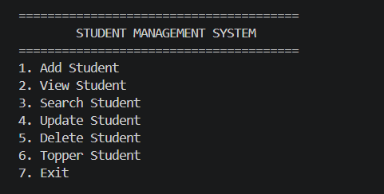
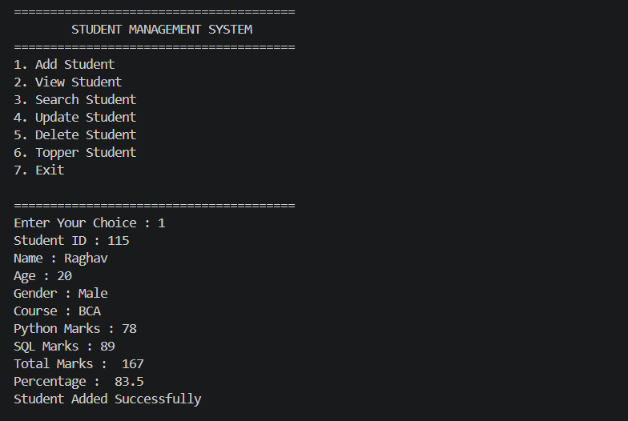
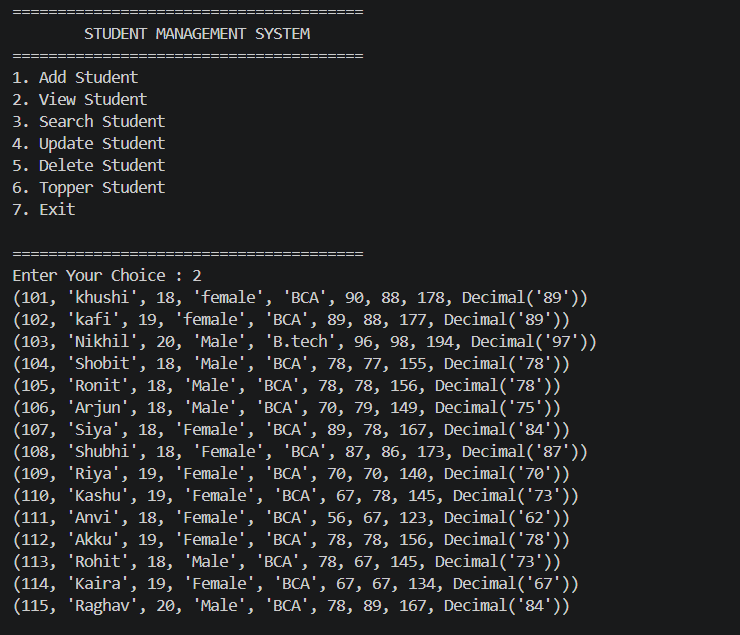
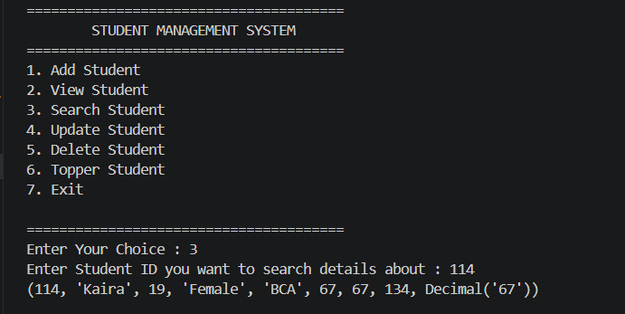
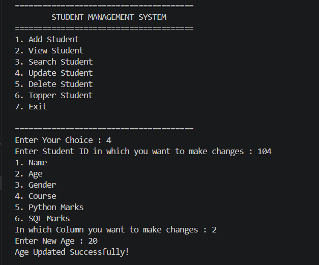
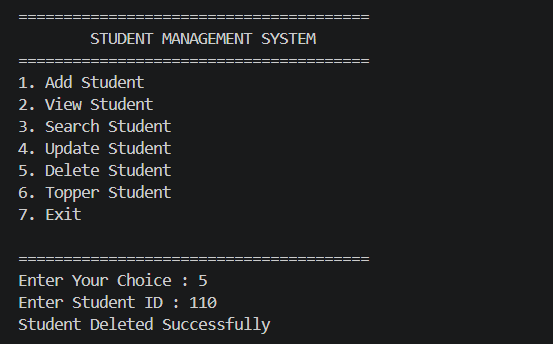
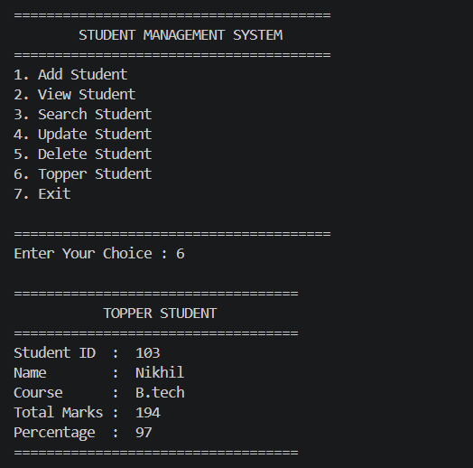

#  Student Management System (Python + MySQL)

A simple **Student Management System** built using **Python** and **MySQL**. This is a command-line (CLI) project that allows users to manage student records efficiently by performing CRUD operations and calculating student results.

---

##  Features

-  Add New Student
-  View All Students
-  Search Student by ID
-  Update Student Details
-  Delete Student Record
-  Display Topper Student
-  Automatic Total Marks & Percentage Calculation
-  Input Validation
-  MySQL Database Integration

---

##  Technologies Used

- Python 3
- MySQL
- mysql-connector-python

---

## 📂 Project Structure

```text
Student-Management-System/
│
├── menu.png
├── add_student.png
├── view_students.png
├── search_student.png
├── update_student.png
├── delete_student.png
├── topper_student.png
├── main.py
└── README.md
```

---

##  Database

Create a database named:

```sql
CREATE DATABASE khushi_db;
```

Create the **Students** table:

```sql
CREATE TABLE Students (
    Student_ID INT PRIMARY KEY,
    Name VARCHAR(100),
    Age INT,
    Gender VARCHAR(20),
    Course VARCHAR(100),
    Python_Marks INT,
    SQL_Marks INT,
    Total_Marks INT,
    Percentage FLOAT
);
```

---

##  Installation

### 1. Clone the repository

```bash
git clone https://github.com/lakshmi1810-create/student-management-system.git
```

### 2. Navigate to the project

```bash
cd student-management-system
```

### 3. Install MySQL Connector

```bash
pip install mysql-connector-python
```

### 4. Configure Database

Open **main.py** and update your MySQL credentials if required.

```python
mydb = mysql.connector.connect(
    host="localhost",
    port=3306,
    user="root",
    password="",
    database="khushi_db"
)
```

### 5. Run the project

```bash
python main.py
```

---

##  Screenshots

###  Main Menu



---

###  Add Student



---

###  View Students



---

###  Search Student



---

###  Update Student



---

###  Delete Student



---

###  Topper Student


---

##  Menu Options

```
1. Add Student
2. View Student
3. Search Student
4. Update Student
5. Delete Student
6. Topper Student
7. Exit
```

---

##  Future Improvements

- Login Authentication
- GUI using Tkinter
- Result Grade Calculation
- Attendance Management
- Export Data to Excel/PDF
- Search by Name
- Course-wise Student List

---

##  Learning Outcomes

This project helped me understand:

- Python Functions
- Exception Handling
- CRUD Operations
- MySQL Database Connectivity
- SQL Queries
- Input Validation
- Database Management using Python

---

##  Author

**Lakshmi Chauhan**

GitHub: https://github.com/lakshmi1810-create

---

## ⭐ Support

If you found this project helpful, consider giving it a **⭐ Star** on GitHub.

It motivates me to build more projects.

---

## 📄 License

This project is created for learning and educational purposes.
